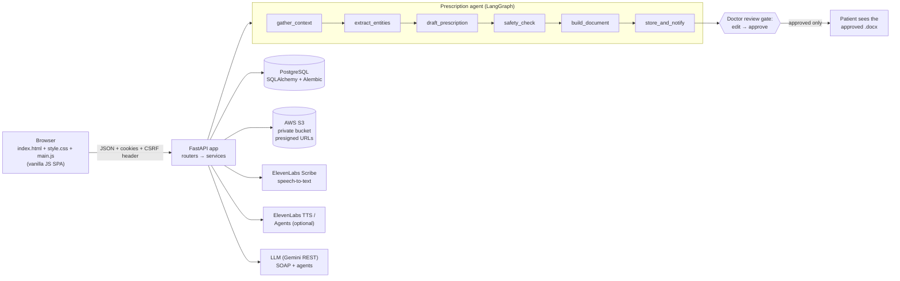

# ClinicalScribe

ClinicalScribe is a web platform where **verified doctors** record or upload a consultation, the system turns the audio into a transcript, an AI drafts a SOAP note, and AI agents then draft a **prescription as a Word (.docx) document** with the doctor's details at the top. The doctor reviews, edits and approves it. **Only approved prescriptions become visible to the patient.**

> **This is a student / portfolio project that uses synthetic data only.** Never put real patient data into it. It makes no claim of HIPAA, DPDP or any other regulatory compliance, and the drug-safety checks are heuristics, not a clinical decision-support system. It is designed with those principles in mind (least privilege, audit trail, encryption, consent), nothing more.

*Screenshots: add captures of the doctor review screen, the admin queue and the patient prescription page here.*

## Roles

| Role | What they do |
|---|---|
| **Patient** | Registers, finds verified doctors, books appointments, grants and revokes consent, downloads approved prescriptions (and can listen to a summary when voice is enabled), reports a doctor |
| **Doctor** | Registers with license details, uploads a license certificate, waits for admin approval; once **verified** runs consults (record / upload / paste), reviews the SOAP note, reviews and approves the AI-drafted prescription |
| **Admin** | Reviews license submissions (with registry evidence), approves / rejects / suspends / reinstates doctors, reads patient reports, browses the audit log |

Authentication is deliberately simple: **email + password stored in PostgreSQL**. Doctors have **one extra gate**: a medical-license check that an admin must approve before any clinical feature works (enforced in the backend on every request).

## Architecture



```
app/
  main.py            app factory, middleware (security headers, CSRF, body limit), routers, SPA index
  config.py          pydantic-settings; fail-fast production validation
  deps.py            get_current_user, require_role, require_verified_doctor, CSRF check
  models/            SQLAlchemy models        schemas/   Pydantic request/response models
  routers/           thin HTTP layer          services/  all business logic
    services/verification.py   state machine + registry checker      services/safety.py     deterministic flags
    services/prescription_agent.py  LangGraph pipeline                services/docx_builder.py  python-docx rendering
    services/speech.py / voice_agent.py / llm.py / scribe.py / storage.py / uploads.py / jobs.py / audit.py
  templates/index.html   static/style.css   static/main.js     (the whole frontend: exactly three files)
alembic/             migrations      scripts/   create_admin, seed_registry, seed_demo      tests/   pytest suite
docs/                DECISIONS.md, CHANGES_MADE.md
```

## Setup

Requires **Python 3.11+**.

```bash
python3.11 -m venv .venv
source .venv/bin/activate            # Windows PowerShell: .\.venv\Scripts\Activate.ps1
pip install -r requirements-dev.txt  # runtime + tests + lint (use requirements.txt for a production image)
cp .env.example .env                 # Windows: Copy-Item .env.example .env
```

`.env` is git-ignored; only `.env.example` (fake values) is committed. Never commit real keys.

### Quick local run (no cloud accounts needed)

Edit `.env`:

```env
ENV=development
SECRET_KEY=<any random string of 16+ characters>
DATABASE_URL=sqlite:///./clinicalscribe.db     # or a local/Render Postgres URL
STORAGE_BACKEND=local                          # files go to .local_storage/ (git-ignored)
STT_PROVIDER=mock                              # returns a fixed sample transcript, ignores the audio
LLM_PROVIDER=mock                              # canned SOAP/prescription, NOT based on your transcript
VOICE_AGENT_PROVIDER=none
```

The mock providers exist so the whole workflow can be demonstrated without keys. The UI shows a yellow **demo** banner whenever a mock is active. They are refused when `ENV=production`. With `LLM_PROVIDER=gemini` and no real key, SOAP generation **fails with a clear message** instead of inventing a note.

```bash
alembic upgrade head                    # create / update the schema
python -m scripts.create_admin          # first admin from ADMIN_BOOTSTRAP_EMAIL / _PASSWORD (12+ chars, letters + digits)
python -m scripts.seed_demo             # optional: synthetic doctors, patient, consent, sample consult (dev only)
uvicorn app.main:app --reload           # http://127.0.0.1:8000  (API docs at /docs in development)
```

Demo accounts created by `seed_demo` (all synthetic, password `DemoPass123`): `dr.demo@example.com` (verified doctor), `dr.pending@example.com` (waiting in the admin queue), `patient.demo@example.com` (has consented to the demo doctor).

## Environment variables

| Key | Meaning |
|---|---|
| `ENV` | `development` or `production`. Production turns on `Secure` cookies, HSTS, strict startup validation and hides `/docs` |
| `SECRET_KEY` | Signs JWTs and CSRF tokens. Production needs 32+ random characters |
| `ACCESS_TOKEN_EXPIRE_MINUTES` | Session lifetime (default 60) |
| `DATABASE_URL` | `postgresql+psycopg://…?sslmode=require` (a `postgres://` or `postgresql://` URL is normalised). `sslmode=require` is mandatory for non-local hosts in production. SQLite is accepted for local runs |
| `ADMIN_BOOTSTRAP_EMAIL` / `_PASSWORD` | Used once by `scripts/create_admin.py`; weak passwords are refused |
| `STORAGE_BACKEND` | `local` (development only) or `s3` (required in production) |
| `LOCAL_STORAGE_DIR` | Optional override of `.local_storage/` |
| `AWS_ACCESS_KEY_ID`, `AWS_SECRET_ACCESS_KEY`, `AWS_REGION`, `S3_BUCKET_NAME` | S3 access. Keys stay on the server |
| `PRESIGNED_URL_EXPIRY_SECONDS` | Lifetime of file download links (default 300) |
| `LLM_PROVIDER` | `gemini` (real) or `mock` (development demo only) |
| `LLM_API_KEY`, `LLM_MODEL`, `LLM_BASE_URL` | Gemini REST settings. Check that the model id exists for your account |
| `ELEVENLABS_API_KEY` | Speech-to-text and voice features |
| `STT_PROVIDER` | `elevenlabs` or `mock` |
| `STT_MODEL`, `STT_LANGUAGE` | Scribe model id (`scribe_v1` / `scribe_v2`) and `en` / `hi` / `auto` |
| `MAX_AUDIO_MB` | Audio upload limit and recorder length limit (default 25) |
| `DELETE_AUDIO_AFTER_TRANSCRIPTION` | Delete the audio object (and its files row, audited) once transcribed |
| `VOICE_AGENT_PROVIDER` | `elevenlabs` or `none`. `none` removes every voice control and the endpoints answer 404 |
| `ELEVENLABS_VOICE_ID`, `ELEVENLABS_AGENT_ID` | TTS voice and (optional) conversational agent |

In production the app **refuses to start** if a required secret is missing or still a placeholder, if mock providers are selected, if storage is not S3, or if the database URL lacks `sslmode=require`. Secrets are never logged or returned to clients.

## PostgreSQL on Render

1. In the Render dashboard create a PostgreSQL instance and copy its **External Database URL**.
2. Set `DATABASE_URL` to it, changing the scheme to `postgresql+psycopg://` and keeping `?sslmode=require`.
3. Apply the schema from your machine (or let the Render start command do it on every deploy):
   ```bash
   alembic upgrade head
   ```
4. Note: Render's free Postgres instances **expire** after a limited period; export what you need or use a paid plan for anything you want to keep.

## Deploying to Render

`render.yaml` is a Render Blueprint for one Python web service.

1. Push this repository to GitHub, then in Render choose **New → Blueprint** and select the repo.
2. Render prompts for every `sync: false` variable. Fill in at least: `SECRET_KEY` (32+ random characters), `DATABASE_URL` (with `?sslmode=require`), `ADMIN_BOOTSTRAP_EMAIL` / `ADMIN_BOOTSTRAP_PASSWORD` (12+ characters, letters and digits), the AWS keys and `S3_BUCKET_NAME`, `LLM_API_KEY`, `LLM_MODEL` and `ELEVENLABS_API_KEY`. Voice IDs can stay empty while `VOICE_AGENT_PROVIDER=none`.
3. Deploy. The start command, `sh scripts/start.sh`, runs `alembic upgrade head`, creates the first admin from `ADMIN_BOOTSTRAP_*` (skipped if it already exists), and starts uvicorn on `$PORT` with proxy headers trusted so rate limits see the real client IP. Render's health check calls `/healthz`, which also pings the database.
4. If the service exits at startup, read the deploy log: production validation names the missing or placeholder variable (`FATAL: …`).

Keep the service at **one instance / one worker**: background jobs and rate limits live in process memory. On the free plan the service sleeps when idle, so the first request after a pause is slow. The Docker image (`Dockerfile`) uses the same `scripts/start.sh` entrypoint if you prefer a Docker runtime.

The migrations are written for PostgreSQL (native enums, JSONB, partial unique indexes) and also run on SQLite for local work. On PostgreSQL the `audit_logs` and `verification_events` tables additionally reject UPDATE, DELETE and TRUNCATE through triggers.

## S3 bucket and IAM policy

Create a **private** bucket: Block Public Access ON (all four settings), default encryption (SSE-S3 or better), **versioning enabled** (a re-uploaded license certificate keeps the old object), no public ACLs. Files are only ever read through `GET /api/files/{id}`, which checks permissions, writes an audit entry and redirects to a presigned URL that expires after `PRESIGNED_URL_EXPIRY_SECONDS`.

Least-privilege IAM policy for the app's IAM user (replace `BUCKET`):

```json
{
  "Version": "2012-10-17",
  "Statement": [
    {
      "Effect": "Allow",
      "Action": ["s3:GetObject", "s3:PutObject", "s3:DeleteObject"],
      "Resource": "arn:aws:s3:::BUCKET/*"
    },
    {
      "Effect": "Allow",
      "Action": "s3:ListBucket",
      "Resource": "arn:aws:s3:::BUCKET"
    }
  ]
}
```

Object keys follow `{role}/{user_id}/{category}/{uuid4}.{ext}` (prescriptions: `doctor/<id>/prescriptions/<consult_id>/v2-<uuid>.docx`); the client filename never appears in a key.

## ElevenLabs

1. Create an API key at elevenlabs.io and put it in `ELEVENLABS_API_KEY`. Keep `STT_PROVIDER=elevenlabs` for real transcription (`STT_MODEL=scribe_v1` or `scribe_v2`; speaker labels are requested via `diarize`).
2. **Voice (optional):** pick a voice id (`ELEVENLABS_VOICE_ID`) for the patient's "Listen to summary". For the optional assistant create a Conversational AI agent, put its id in `ELEVENLABS_AGENT_ID`, and write the agent's system prompt so it uses the dynamic variables `{{prescription_summary}}`, `{{patient_first_name}}` and `{{guardrails}}` (explain only what is written, give no new medical advice, send urgent symptoms to the doctor or emergency services, never discuss other patients). The server creates the signed URL, so the API key never reaches the browser.
3. **Disable voice cleanly:** `VOICE_AGENT_PROVIDER=none`. The UI hides the controls, the endpoints answer 404, and the CSP does not allow the ElevenLabs websocket.

Endpoints and field names were checked against the ElevenLabs documentation on 2026-10-02 and are marked `# VERIFY AGAINST DOCS` in the code, but **the live ElevenLabs calls could not be exercised without real credentials** (see Known limitations).

## Running the tests

```bash
pytest                                   # SQLite, local storage, mocked LLM / ElevenLabs, moto for S3
TEST_DATABASE_URL=postgresql://user:pw@localhost:5432/clinicalscribe_test pytest   # same suite on PostgreSQL
```

`TEST_DATABASE_URL` points at a **disposable database**: its `public` schema is dropped and rebuilt from the Alembic migrations before the run. Running on PostgreSQL also enables the append-only trigger tests.

## Demo walkthrough

Use `LLM_PROVIDER=mock STT_PROVIDER=mock` for a no-keys demo (the mock transcript matches the canned prescription).

1. **Register a doctor** (`#/register`, choose *Doctor*). Run `python -m scripts.seed_registry` first, then use a seeded registry entry to see a perfect evidence match, e.g. registration `TN-2010-22001`, council `Tamil Nadu Medical Council`, name `Dr. Lakshmi Narayanan` (each registration number can belong to only one non-rejected doctor, so `seed_demo`'s own doctor already holds `MH-2015-12345`). You land on *Verify your license*.
2. **Upload the license** certificate (PDF/JPG/PNG). The doctor still cannot use any clinical feature.
3. **Admin approves.** Sign in as the admin → *Verification*. The queue shows the registry evidence (match, name score, duplicate flag). Open the doctor, view the certificate, **Approve** (or Reject with a reason of 10+ characters).
4. **Patient registers**, opens *Doctors*, books an appointment (the dialog can grant consent at the same time) and, if needed, grants consent under *Consents*.
5. **Doctor starts a consult** from the dashboard or *New consult*, then records in the browser, uploads audio, or pastes a transcript.
6. **Transcript → SOAP.** Review the transcript, press *Generate SOAP note*, edit the SOAP fields and ICD-10 chips, press *Approve SOAP and draft prescription*.
7. **The agent drafts the prescription** (progress is shown; it finishes in seconds with the mock) and marks the consult *ready for review*.
8. **Doctor reviews** the draft: edit medications, read the safety flags next to the highlighted source quotes, tick *I have reviewed the high-risk flags* if there are any, and **Approve**. Saving edits creates a new version; an approved prescription is never edited in place.
9. **Patient downloads** the approved `.docx` from *Prescriptions* (and, with voice on, presses *Listen to summary*). Before approval the patient sees nothing.
10. **Admin** opens *Audit log* to see sign-ins, verification decisions, file access and approvals.

## Security notes

- Passwords: argon2id; login always performs a hash verification; wrong email and wrong password give the identical response. Login is limited to 5/minute per IP **and** per email; registration to 5/hour per IP.
- Sessions: signed JWT in an `HttpOnly`, `SameSite=Lax` (`Secure` in production) cookie. The user, role and doctor status are **re-read from the database on every request**, so suspending a doctor takes effect on their next click.
- CSRF: signed double-submit token on every state-changing request; only login and registration are exempt (no session exists yet; both are rate limited).
- Permissions are enforced in the backend. Every `{id}` route checks ownership or consent; patient and admin views of consults and prescriptions are metadata-only (admins may open a consult only through a report, and that is audit-logged with the report id).
- Uploads: size, extension, declared MIME type **and** magic bytes must agree; random S3 keys; bounded reads; request-body size limit (413).
- Headers: the spec CSP (`script-src 'self'`, `style-src 'self'`, no inline script/style, no external resources), `nosniff`, `X-Frame-Options: DENY`, `Referrer-Policy`, `Permissions-Policy: microphone=(self)`, HSTS in production. CORS is off.
- Frontend: no `innerHTML` anywhere; all server data is rendered as text.
- Audit: every login result, verification transition, file access, consent change, SOAP/prescription action, voice use and admin action is written to an append-only log (database triggers on PostgreSQL).
- The AI never issues a prescription: drafts are always labelled DRAFT, an unresolved high-risk flag blocks approval in the backend too, and the patient sees nothing until the doctor approves.

## Known limitations

- **Live providers were not tested.** ElevenLabs (STT, TTS, agent), the Gemini LLM and a real AWS S3 account need credentials this project did not have. Their request formats were checked against the public docs and covered by tests with stubbed HTTP (and moto for S3), but no real call has been made. Treat first use as a smoke test. The browser voice assistant (websocket audio streaming) is beta and untested against a real agent.
- Background jobs run **in-process** on a small thread pool: a restart loses in-flight work (the sweeper and the "timed out, click Retry" state recover it), and multiple workers are not supported. Use a real queue for production.
- The registry check is a **mock** table; production would call the ABDM Healthcare Professionals Registry (stubbed, never scraped).
- The safety checks (medication/dose present in the source, allergy name and a small drug-class map) are conservative heuristics. They are not a clinical drug database.
- JWT sessions are stateless: logging out clears the cookie but does not revoke a copied token before it expires. The CSRF token is not bound to a session. Rate limiting is per-process memory.
- No MFA, email verification, password reset or social login (out of scope for this version).
- A "demo" LLM/STT mock exists for development; it returns canned content that does not depend on your input, and is blocked in production.
- Browser behaviour was verified by hand in Chromium; there is no automated browser test suite.

## Production path

Real ABDM HPR integration for license checks; email verification, password reset and MFA; KMS-managed encryption and key rotation; malware scanning of uploads; a proper job queue (Celery/RQ/SQS) instead of in-process tasks; server-side session revocation; DPDP-style consent records, retention rules and data-subject workflows; clinical validation of the drug-safety checks against a maintained formulary; centralised logging and alerting; load and security testing.

## Future work

Appointment slots and calendar sync, e-signature of approved prescriptions, pharmacy hand-off, multilingual SOAP/prescription output, automated browser tests, and an admin analytics view.
